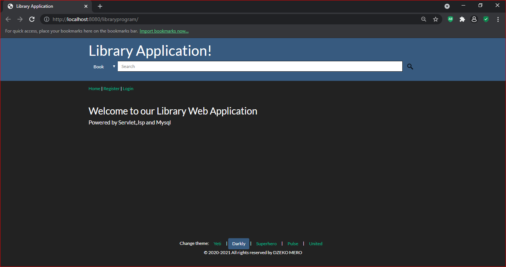
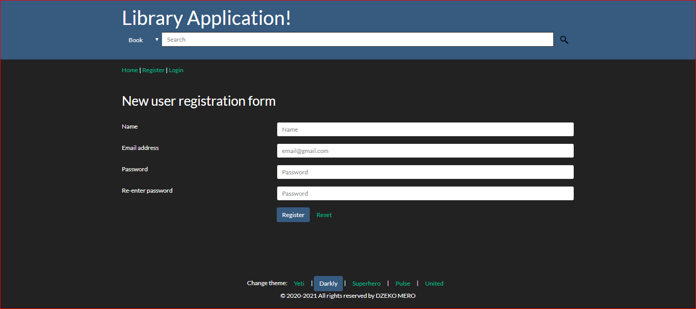
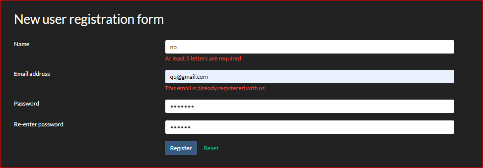
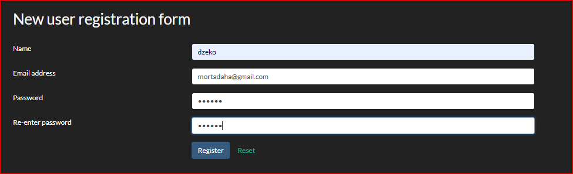
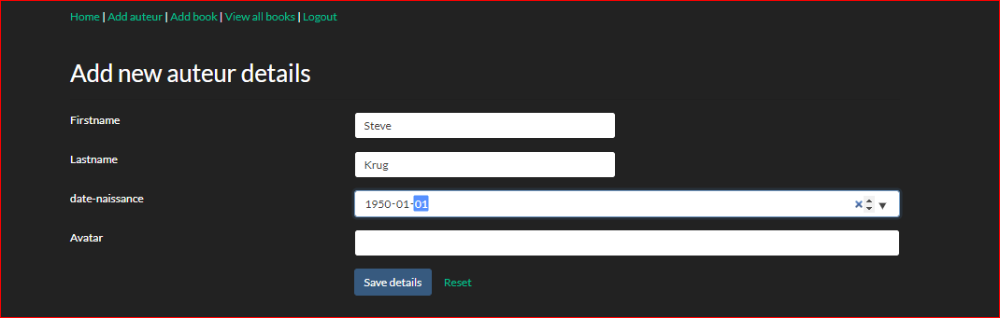
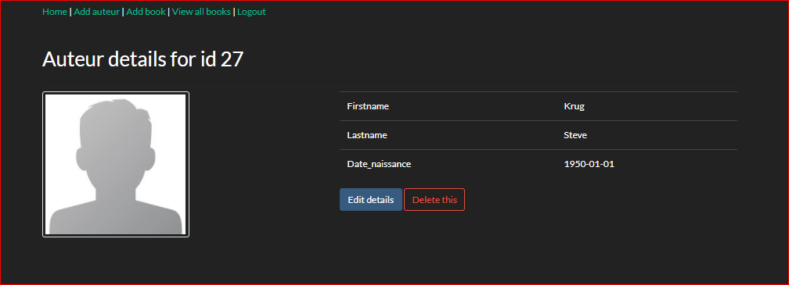
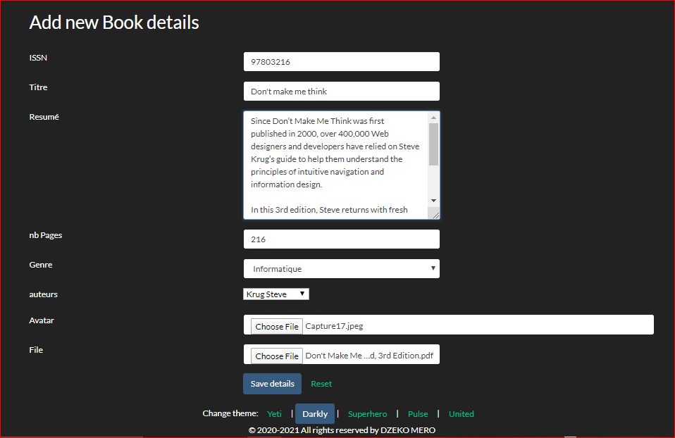

# WebApp-Library-Management-System

Library web application with servlet jsp jstl msyql

## tech used:
* JSP - 2.2 +
* IDE - Apache NetBeans IDE 12.3
* JDK - 15.0.1
* GlassFish Server 5.1.0
* JSTL - 1.2
* MySQL - mysql-connector-java-5.1.49.jar
* jbcrypt-0.4.jar 
* Wampserver 3.2.2
* Bootstrap : Free themes for Bootstrap [bootswatch](https://bootswatch.com/)

## Screenshots

